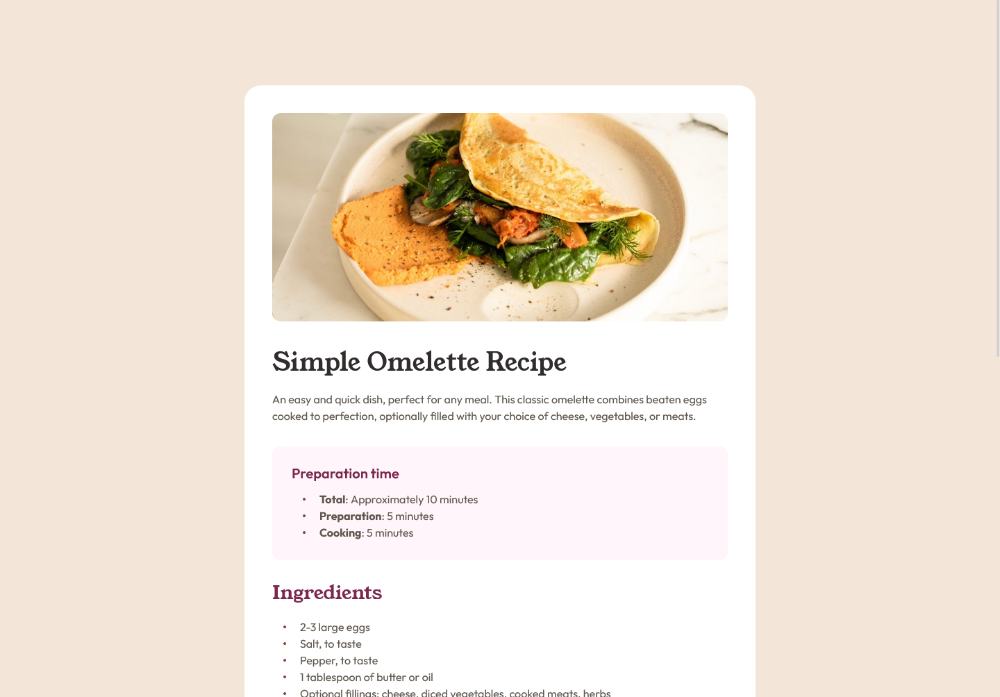

# Frontend Mentor - Recipe page solution

This is a solution to the [Recipe page challenge on Frontend Mentor](https://www.frontendmentor.io/challenges/recipe-page-KiTsR8QQKm). Frontend Mentor challenges help you improve your coding skills by building realistic projects. 

### Screenshot

### Links

- Solution URL: [Add solution URL here](https://www.frontendmentor.io/solutions/recipe-page-XLkOmauKv0)
- Live Site URL: [Add live site URL here](https://meelix.github.io/frontendmentor-recipe-page)

## My process

Dirty

## What I learned

My css is horrendous, but this time I at least tried.

### Useful resources

- [Transfonter](https://transfonter.org/) - Usefull to reduce font file sizes and generate css for `@font-face`.